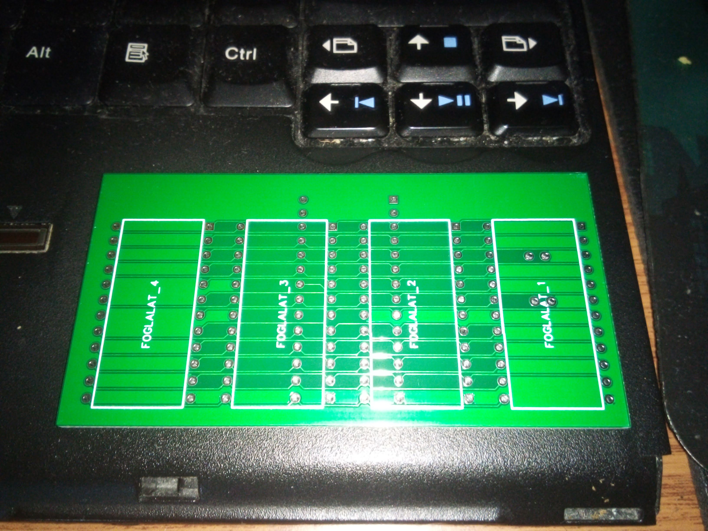
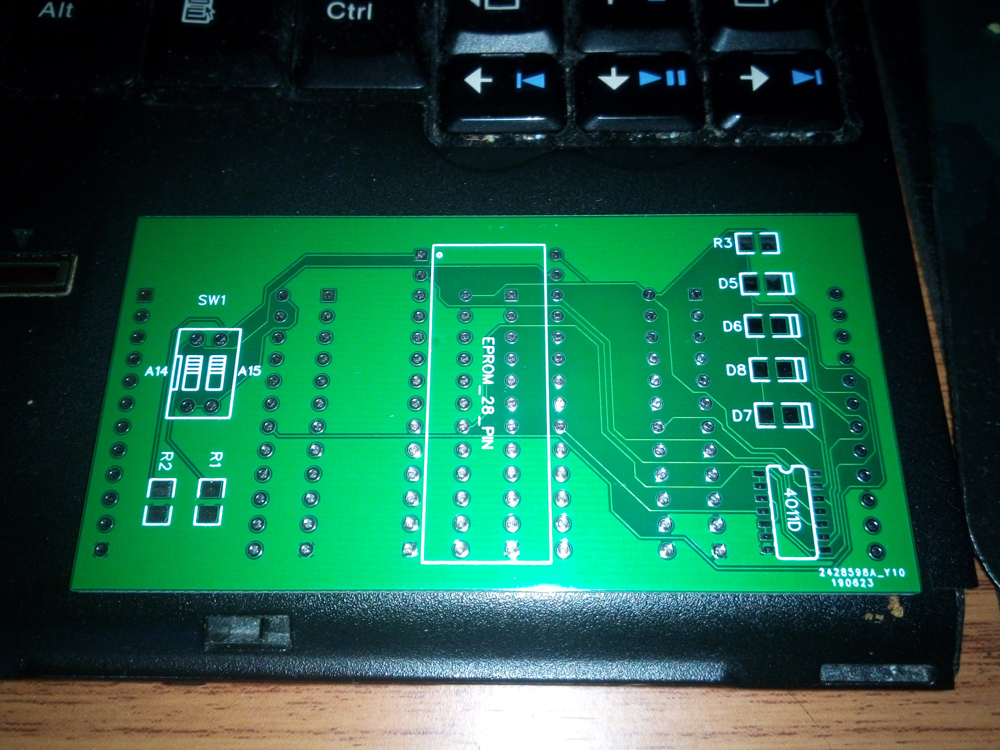
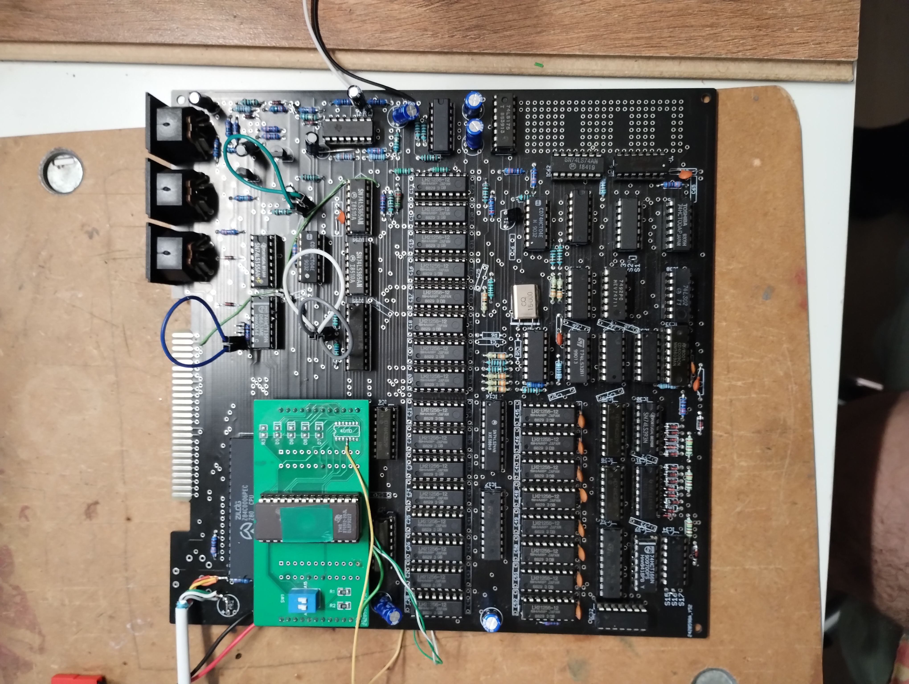

# Primo-multirom
A primo számítógéphez tervezett 2732 epromokat 27512 eprommal kiváltó foglalat, amibe 4 db romtartalom írható. A romtartalmak kiválasztása a dip kapcsolókkal történik.
Az egyszerűsített változatba nem kell beépíteni a CD4011 IC-t, a 4 diórdát s az R3 ast, hanem a primóból kell bevezetékezni az A12 és A13 és /CE jeleket a 27512 eprom lábaira.
A jeleket az IC61 es 13 as (A13) 14 es (A12) és 4 es (/CE) lábakról kell levenni, s az eprom 2 es (A12) 26os (A13) 20 as (/CE) lábaira bekötni.
R1 és R2 értéke 10 kOhm.

Lusta változat

Teljes változat

